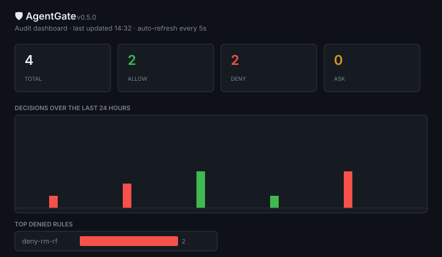

# AgentGate

[](https://pypi.org/project/agentgate-firewall/)
[](https://github.com/FelixMa01/agentgate/actions)
[](https://github.com/FelixMa01/agentgate/actions)
[](LICENSE)
[](https://github.com/FelixMa01/agentgate)

[]()

# AgentGate

**Firewall for AI coding agents — intercept, log, approve every action.**



> **One-line firewall for AI coding agents.** Intercepts every tool call, network request, and human approval — let Claude Code / Cursor / Continue.dev / Aider / GitHub Actions touch what you allow, block what you don't, ask for the rest.

AgentGate sits between your AI coding agent and the rest of your system. It ships as three small pieces you wire up in 60 seconds:

1. **`agentgate install-hook`** — registers a PreToolUse hook with Claude Code (or any MCP-compatible agent) that intercepts Bash / Read / Write / Edit / WebFetch / Grep / Glob calls.
2. **`agentgate proxy`** — a mitmproxy add-on that intercepts every outbound HTTP(S) request and applies your domain allow/deny list.
3. **`agentgate dashboard`** — a single-page HTML viewer for the audit log, with live stats, time series, and per-rule breakdowns.

When an `ask` action fires, AgentGate posts to a Slack incoming webhook and waits (up to 60s by default) for a human to click **Allow** or **Deny** at `http://your-host:8765/approve/<token>`.

---

## Quick start

```bash
# 1. Install
git clone https://github.com/FelixMa01/agentgate && cd agentgate
uv sync

# 2. Init a policy + audit DB in your project
cd ~/code/my-project
agentgate init --dir .                 # writes ./policy.yaml + ./audit.db

# 3. Wire it into Claude Code (writes .claude/settings.local.json)
agentgate install-hook \
    --policy ./policy.yaml \
    --db ./audit.db \
    --target .                         # project scope (or --scope user for all projects)

# 4. (optional) Start the network proxy
agentgate proxy -p ./policy.yaml --db ./audit.db   # listens on :8080
export HTTP_PROXY=http://127.0.0.1:8080
export HTTPS_PROXY=http://127.0.0.1:8080

# 5. (optional) Start the approval server (for ASK actions)
agentgate approval-server --port 8765

# 6. Watch the dashboard
agentgate dashboard --db ./audit.db   # http://127.0.0.1:8766
```

---

## Policy format (`policy.yaml`)

```yaml
version: 1
default: allow       # what to do when no rule matches

rules:
  # Match glob-style — * matches across slashes
  - id: deny-rm-rf
    name: Block destructive rm
    match:
      tool: Bash
      command: "rm -rf /*"
    action: deny
    reason: "Mass deletion outside repo"

  # Match a list of patterns — any match fires
  - id: deny-secrets
    name: Block reading secrets
    match:
      tool: Read
      file_glob: ["*.pem", ".env*", "*id_rsa*"]
    action: deny

  # Use ~regex~ prefix to drop into regex land
  - id: ask-outbound
    name: Require approval for outbound network
    match:
      tool: Bash
      command: "~\bcurl\b|\bwget\b"
    action: ask
    reason: "Outbound network from agent"

network:
  allowed_domains:
    - github.com
    - "*.pypi.org"
    - openai.com
    - "*.openai.com"
  denied_domains:
    - pastebin.com
    - "*.transfer.sh"
  require_https: true
```

### Actions

| Action | What happens |
|---|---|
| `allow` | Tool runs. Event logged. |
| `deny` | Tool blocked. Event logged. User sees the reason in the Claude Code transcript. |
| `ask` | Slack message sent. Hook blocks until a human clicks Allow/Deny (or timeout → deny by default). |
| `log` | Tool runs, but the event is recorded even without matching an explicit rule. |

### Pattern matching

- Plain strings are exact matches.
- Glob (`*`, `?`) patterns use Python's `fnmatch.translate`, so `*` **does** match `/`.
- A leading `~` switches to regex mode: `"~\\brm\\s+-rf\\b"`.
- Patterns can be a list — any match fires.
- Suffix `_glob` on a key (e.g. `file_glob`) tries the base name (`file`) if the suffixed key isn't in the event.

---

## Architecture

```
   ┌──────────────────────────┐
   │   Claude Code / Codex    │
   │   (Bash, Read, Write,    │
   │    Edit, WebFetch, ...)  │
   └────────────┬─────────────┘
                │ tool call
                ▼
   ┌──────────────────────────┐         ┌─────────────────┐
   │  bin/agentgate-hook.py   │ ──────▶ │  policy.yaml    │
   │  (PreToolUse, JSON stdin │         │  + SQLite audit │
   │   JSON stdout response)  │ ◀────── │  (events table) │
   └────────────┬─────────────┘         └─────────────────┘
                │ if ask → Slack + wait
                ▼
   ┌──────────────────────────┐
   │  approval server :8765   │
   │  GET /approve/<token>?d= │
   └──────────────────────────┘

   ┌──────────────────────────┐         ┌─────────────────┐
   │  mitmproxy add-on :8080  │ ──────▶ │  policy.yaml    │
   │  (every HTTP request)    │         │  network section│
   └──────────────────────────┘         └─────────────────┘
```

The hook, proxy, and approval server all read the **same `policy.yaml`** and write to the **same `audit.db`**. The dashboard reads only the DB.

---

## CLI

```
agentgate init                       # scaffold a default policy.yaml + audit.db
agentgate eval -p policy.yaml --db audit.db --event-json '{"tool":"Bash","command":"x"}'
agentgate audit --db audit.db --limit 20
agentgate stats --db audit.db
agentgate validate -p policy.yaml

agentgate install-hook -p policy.yaml --db audit.db --target .
agentgate uninstall-hook --target .

agentgate proxy -p policy.yaml --db audit.db --listen-port 8080
agentgate approval-server --port 8765
agentgate dashboard --db audit.db --port 8766

agentgate ask-test -p policy.yaml --db audit.db --event-json '{...}'
```

---

## Slack approval flow

Set `AGENTGATE_SLACK_WEBHOOK=https://hooks.slack.com/services/...` and AgentGate will post a Block Kit message with **Allow** / **Deny** buttons. Without a webhook, it falls back to writing the JSON to `/tmp/agentgate-asks.jsonl` so you can wire your own channel.

When the human clicks Allow / Deny, the request hits `http://your-host:8765/approve/<token>?d=allow`. The approval server writes the decision into the SQLite approvals table; the waiting hook (which may be a different process) sees the update via in-process notification + DB poll fallback.

If no human responds within `AGENTGATE_ASK_TIMEOUT` (default 60s), the hook **denies by default** — fail-closed.

---

## Why not just use the agent's built-in permissions?

You can — but AgentGate gives you:

1. **Network egress control.** Built-in permissions don't see what your agent calls over the wire.
2. **Centralized policy.** One YAML for the whole team, instead of scattered `.claude/settings.json` files.
3. **Cross-tool unified audit.** One DB for every tool, hook, and proxy — searchable, time-seriesed, shareable.
4. **Human-in-the-loop without leaving your chat.** Slack approve/deny buttons beat terminal prompts.
5. **Postmortem-friendly.** Every decision has a rule_id, reason, and full event payload.

---

## Status

🟢 Day 5 shipped. See `/api/stats` on the dashboard for live numbers.

| Day | Deliverable | Status |
|---|---|---|
| 1 | Policy DSL + SQLite audit + CLI | ✅ |
| 2 | Claude Code PreToolUse hook + install/uninstall | ✅ |
| 3 | mitmproxy add-on for network egress | ✅ |
| 4 | Slack approval + cross-process HTTP server | ✅ |
| 5 | Single-page HTML dashboard + Product Hunt launch | ✅ |

48 unit tests passing. End-to-end verified on macOS (Apple Silicon, Python 3.13 via uv).

## License

Apache 2.0.