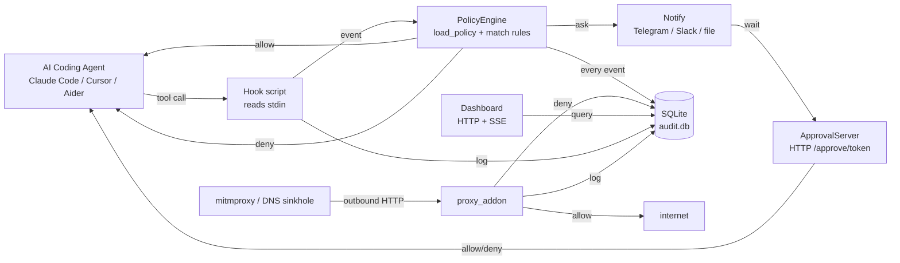
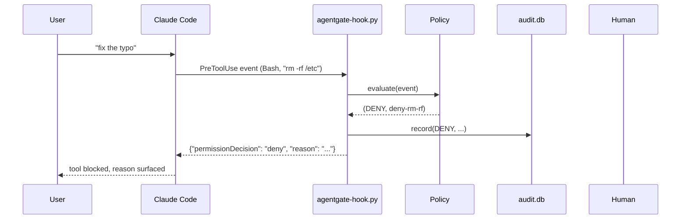
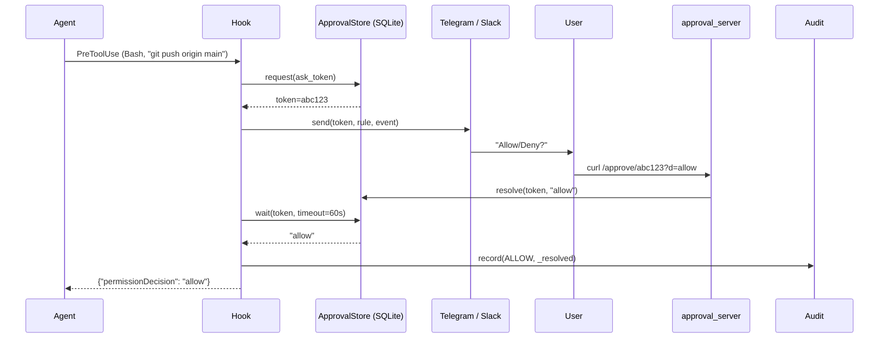
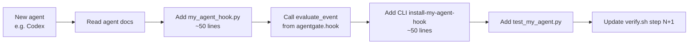

# AgentGate architecture

A single diagram is worth a thousand comments.

## High-level flow



## Component map

```mermaid
graph TB
    subgraph CLI
        CLI[cli/main + 13 subcommands]
    end
    subgraph Hooks
        CC[hook.py - Claude Code]
        CUR[cursor_hook.py - Cursor]
        CONT[continue_hook.py - Continue.dev]
        AID[aider_adapter.py - Aider]
        GH[actions_annotate.py - GitHub Actions]
    end
    subgraph Network
        MITM[proxy_addon.py<br/>mitmproxy]
        DNS[dns_sinkhole.py<br/>UDP server]
    end
    subgraph Approval
        ASTORE[approval.py<br/>SQLite-backed STORE]
        ASVR[approval_server.py<br/>HTTP /approve]
    end
    subgraph Audit
        A1[audit.py<br/>SQLite]
    end
    subgraph Policy
        P1[policy.py<br/>YAML + match]
    end
    subgraph Notify
        NT[notify.py<br/>Telegram / Slack / file]
    end
    subgraph Dashboard
        DASH[dashboard.py<br/>HTTP + SSE + HTML]
    end
    subgraph Hosted
        HOST[hosted.py<br/>pull-policy / push-events]
    end
    CLI --> P1
    CLI --> A1
    CC --> P1
    CC --> A1
    CC --> ASTORE
    CC --> NT
    CUR --> P1
    CONT --> CC
    AID --> P1
    GH --> P1
    MITM --> P1
    MITM --> A1
    DNS --> P1
    ASVR --> ASTORE
    ASTORE --> A1
    NT --> ASVR
    DASH --> A1
    HOST --> A1
    HOST --> P1
```

## Data flow: a tool call that gets denied



## Data flow: ASK round-trip



## Where to add a new adapter



The whole new adapter is ~100-150 lines of Python + a CLI flag.

## Performance characteristics

| Layer | Latency (typical) | Notes |
|---|---|---|
| Hook (Claude Code → SQLite → response) | <5 ms | One policy.evaluate + one audit.record, both <1 ms |
| Proxy (HTTP → mitmproxy → decision) | <10 ms | Adds one sqlite read per request |
| Dashboard SSE poll | 1 s | Server polls DB every 1s; not event-driven |
| Approval round-trip (ASK) | 1-60 s | Mostly Slack/HTTP latency; configurable timeout |
| Policy load (yaml parse) | <10 ms | YAML parsing once per hook invocation |

The hot path (single tool call decision) is dominated by `sqlite3.connect()`,
which we keep open via a per-call `with` block. For 1000 events/minute this
remains negligible.